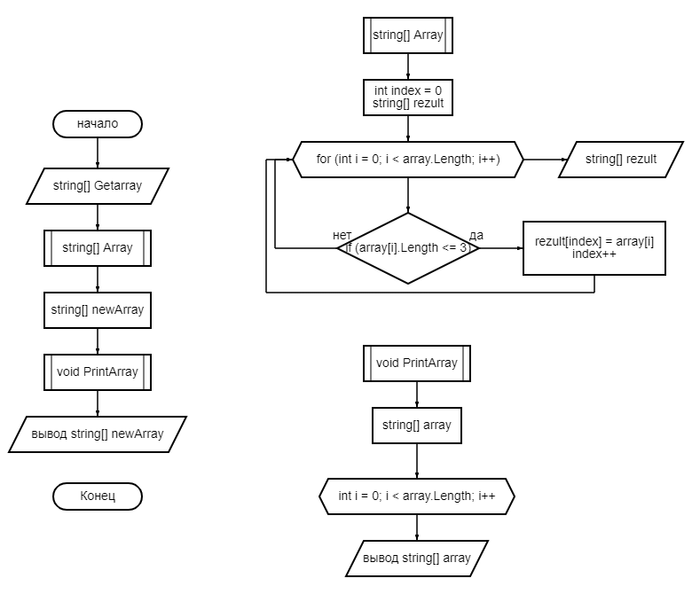

# Задача

### Напишите программу, которая из имеющегося массива строк формирует массив строк, длина которых меньше либо равна 3 символа. Первоначальный массив можно ввести с клавиатурыы, либо задать на старте выполнения алгоритма.

## Алгоритм решения:

Вводим исходный массив, динной в 5 элементов. Потом создаём метод. Он с помощью цикла проверяет каждый элемент исходного массива на выполнение условия - длина элемента должна быть меньше или равна 3 символам. Если условие выполняется, то в новый массив записывается элемент из исходного. Таки образом формируется новый массив.

**Ниже представлена блок-схема процесса решения задачи.**

